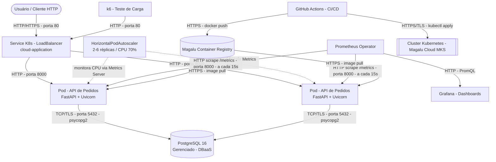

**Aluno:** Nilo Lima Jr
**Repositório do Projeto:** [https://github.com/nilo-lima/move-tech-cloud-application-comp-6](https://github.com/nilo-lima/move-tech-cloud-application-comp-6)

# Documentação de Arquitetura da Solução

## 1. Inventário de Recursos (Cluster & Cloud)

**Cluster Kubernetes (Magalu Cloud – MKS):**
- **API de Pedidos** (`cloud-application`) - container FastAPI (Python 3.11 / Uvicorn), `Deployment` com 2 réplicas fixas mínimas, probes de saúde (`/health`) e limites de CPU/memória definidos.
- **Service** `cloud-application` - tipo `LoadBalancer`, expõe a porta 80 → 8000.
- **HorizontalPodAutoscaler (HPA)** - baseado em utilização de CPU (alvo 70% sobre `requests.cpu`), variando entre 2 e 6 réplicas.
- **ServiceMonitor** (Prometheus Operator) - coleta métricas em `/metrics` a cada 15s, rótulo `release: monitoring`.
- **Prometheus & Grafana** - stack de observabilidade (kube-prometheus-stack), assumida instalada no cluster para que o ServiceMonitor funcione.

**Serviços Externos / Managed Services:**
- **PostgreSQL 16 Gerenciado (DBaaS)** - fora do cluster, acessado via `DATABASE_URL` injetada por `Secret` (`db-secret`).
- **Magalu Container Registry (MCR)** - `container-registry.br-se1.magalu.cloud`, armazena a imagem `cloud-application`.
- **GitHub Actions** - pipeline de CI/CD (`test` + `build-and-deploy`): roda `pytest`, builda e publica a imagem, aplica os manifestos `k8s/` via `kubectl`.
- **k6** - ferramenta de teste de carga, executada sob demanda via workflow manual contra o `Service` público.

## 2. Diagrama C2 (Nível de Containers)

## 3. Requisitos Não-Funcionais (RNFs) & Estilo Arquitetural

**Estilo Arquitetural:** Monolito Modular em Camadas (rotas, modelos, acesso a dados no mesmo processo/container), implantado como aplicação Cloud-Native stateless em contêineres, com escalonamento horizontal automático (HPA) e persistência externa ao cluster.

- **SLA / Disponibilidade Alvo:** 99.5% - mínimo de 2 réplicas ativas simultaneamente (`minReplicas: 2` no HPA) garantem tolerância à perda de 1 pod sem indisponibilidade total; não há multi-região/multi-AZ documentada, por isso o alvo é conservador em relação a 99.9%.
- **Latência Alvo (P95):** < 500 ms - valor de referência (`p95_alvo_ms`) usado como *threshold* padrão no script de teste de carga `load/k6/load-test.js`.
- **Vazão Alvo (RPS):** ~75 RPS sustentados - estimado a partir do cenário padrão de carga do k6 (20 VUs, ciclo de ~1s por iteração com 4 chamadas HTTP cada), com headroom até 6 réplicas via HPA para picos acima disso.
- **Teto de Custo (FinOps):** R$ 200,00/mês (estimativa) - cobre de 2 a 6 réplicas pequenas (100–500m CPU / 128–256Mi RAM), 1 Load Balancer gerenciado e uma instância pequena de PostgreSQL DBaaS. *Ajustar com valores reais da fatura da Magalu Cloud quando disponíveis.*

> **Nota:** os valores de vazão e custo são estimativas derivadas da configuração observada no repositório (não há dados de faturamento reais no código). Recomenda-se substituí-los pelos números reais coletados após a execução do teste de carga (`resumo.md`/`resultado.json`) e da fatura da Magalu Cloud.
